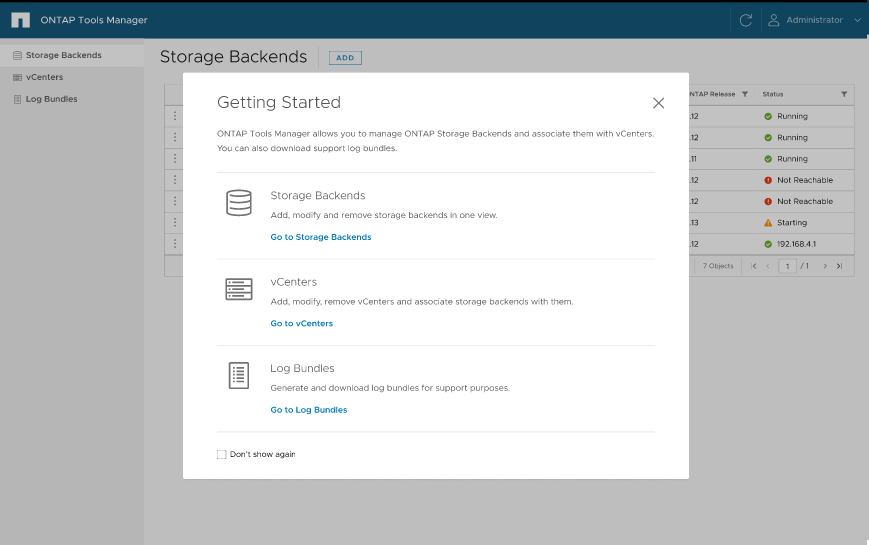

= Interface de usuário do Gerenciador de ferramentas do ONTAP
:allow-uri-read: 
:icons: font
:imagesdir: ../media/

[role="lead"]
As ferramentas do ONTAP para VMware vSphere 10,0 são um sistema de alocação múltipla, que gerencia vários vCenters. Um administrador precisa de mais controle sobre os vCenters que estão sendo gerenciados e os back-ends de armazenamento que estão sendo integrados.

O Gerenciador de ferramentas do ONTAP fornece mais controle e energia ao administrador de ferramentas do ONTAP, o que ajuda no gerenciamento geral do dispositivo, locatários e back-ends de storage.

As ferramentas do ONTAP executam:

* Gerenciamento do vCenter - Registre e desmarque as ferramentas do vCenters para ONTAP
* Gerenciamento de back-end de storage - Registre e desmarque os clusters de storage do ONTAP nas ferramentas do ONTAP e mapeie-os para vcenters integrados globalmente.
+
O back-end de storage é global quando adicionado do Gerenciador de ferramentas do ONTAP ou das APIs comuns, e eles são locais quando adicionados das APIs do vCenter. Exemplo: Para configuração de alocação a vários clientes, é possível adicionar storage de back-end (cluster) globalmente e SVM localmente para usar credenciais diretas da SVM.

* Downloads do pacote de log

Para acessar a IU das ferramentas do ONTAP, inicie `\https://loadBalanceIP:8443/virtualization/ui/` a partir do navegador e faça login com as credenciais de administrador das ferramentas do ONTAP fornecidas durante a implantação.

Você pode selecionar a opção *não mostrar novamente* para não ver essa janela pop-up quando você fizer login novamente a partir do mesmo navegador.
